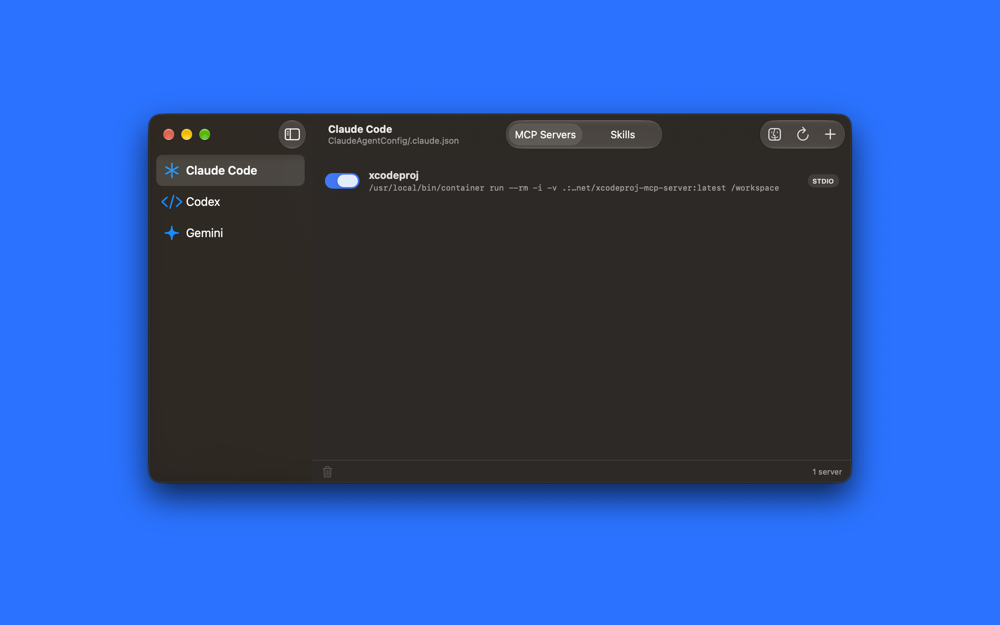
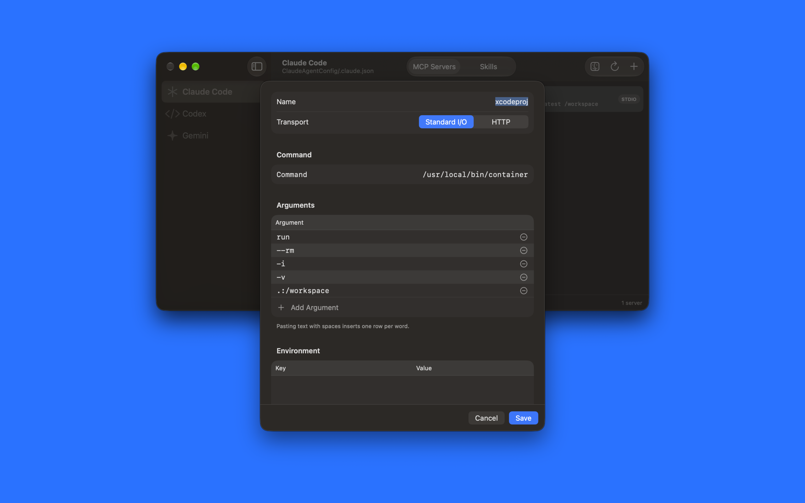
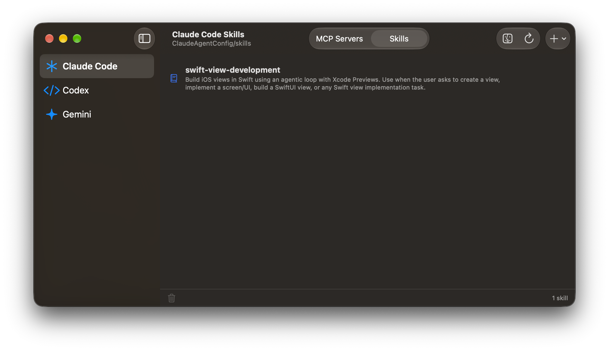
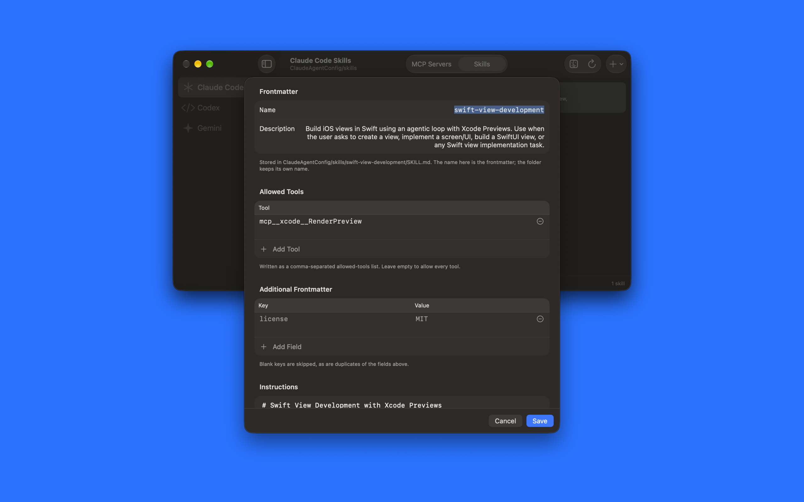

  

# XCAgentHub

A macOS app for managing the MCP servers and skills of the coding agents that run inside Xcode.

Xcode keeps each agent's configuration in its own file, in its own format, under
`~/Library/Developer/Xcode/CodingAssistant`. XCAgentHub puts all three in one window
and writes each file in the format that agent expects.

## What it manages

| Agent | MCP servers | Skills |
| --- | --- | --- |
| Claude Code | `ClaudeAgentConfig/.claude.json` | `ClaudeAgentConfig/skills` |
| Codex | `codex/config.toml` | `codex/skills` |
| Gemini | `gemini/settings.json` | `gemini/skills` |

Pick an agent in the sidebar; the segmented control switches between its MCP servers
and its skills.

## MCP servers

Add stdio and HTTP servers, edit them, and toggle one off without deleting it — the
server is stashed in whichever disabled list that agent understands, so turning it
back on restores it as it was. HTTP servers can be checked with **Test Connection**,
which performs an MCP `initialize` handshake and reports the server name it answers
with.

Every write backs up the configuration file first, and unrelated keys in the file are
preserved.

The copy button in the bottom bar sends the selected servers to another agent, written
in that agent's own format. If the target already has a server of the same name, it
asks before replacing it.

## Skills

A skill is a folder holding a `SKILL.md` with YAML frontmatter. XCAgentHub lists what
each agent has, and creates or edits one through a form rather than a text editor:
dedicated fields for `name`, `description`, and `allowed-tools`, a key/value table for
anything else, and the Markdown body underneath.

Existing files are parsed back into the same form. A `SKILL.md` carrying YAML the form
cannot represent — a comment, a block scalar, a nested map — opens as raw Markdown
instead, so nothing is silently rewritten.

**Add from Folder…** copies a skill folder in, following symlinks so the imported copy
is made of real files. The copy button in the bottom bar sends the selected skills to
another agent, asking first if a folder of the same name is already there.

## License

XCAgentHub is released under the Apache License 2.0. See [LICENSE](LICENSE).
